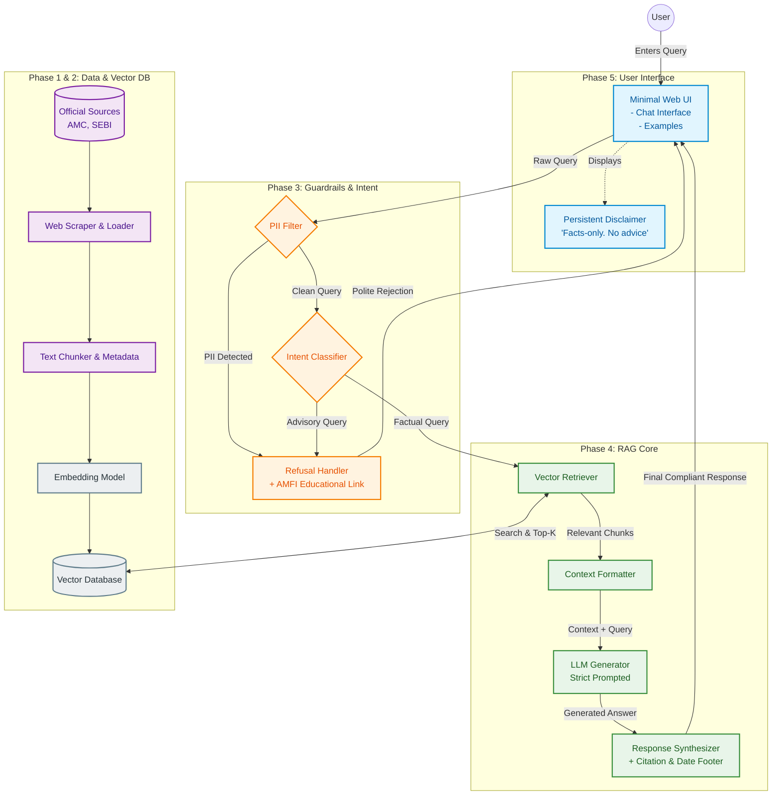

# Phase-Wise Architecture for Mutual Fund FAQ Assistant

## Overview
This document outlines the detailed phase-wise architecture for the **Mutual Fund FAQ Assistant (Facts-Only Q&A)** based on the provided problem statement. The system leverages a lightweight Retrieval-Augmented Generation (RAG) approach to ensure all responses are factual, verifiable, and strictly backed by official sources.

---

## Phase 1: Data Ingestion & Preprocessing (Corpus Construction)
The first phase focuses on gathering the official corpus and preparing the data for the vector database.

### Components
1. **Source Manager:** 
   - Defines the selected AMC (**HDFC Mutual Fund**) and the following 5 target schemes:
     - [HDFC Mid-Cap Opportunities Fund](https://groww.in/mutual-funds/hdfc-mid-cap-fund-direct-growth)
     - [HDFC Flexi Cap Fund](https://groww.in/mutual-funds/hdfc-equity-fund-direct-growth)
     - [HDFC Focused 30 Fund](https://groww.in/mutual-funds/hdfc-focused-fund-direct-growth)
     - [HDFC ELSS Tax Saver Fund](https://groww.in/mutual-funds/hdfc-elss-tax-saver-fund-direct-plan-growth)
     - [HDFC Large Cap Fund](https://groww.in/mutual-funds/hdfc-large-cap-fund-direct-growth)
   - Maintains a curated list of these public URLs as the primary corpus for data extraction.
2. **Web Scraper & Document Loader:** 
   - Downloads HTML pages, PDFs (Factsheets, SID, KIM), and extracts raw text.
   - Ensures no third-party aggregator data is ingested.
3. **Data Cleaner & Metadata Extractor:** 
   - Cleans raw text (removes boilerplate, HTML tags).
   - Attaches strict metadata to each document: `Source URL`, `Document Type`, and `Last Updated Date`.
4. **Text Chunker:** 
   - Splits documents into semantic chunks (e.g., 500-1000 tokens) to ensure precise retrieval. 

### Subphases
- **Subphase 1.1: Project Structure and Source Registry Setup**
  - Create the multi-phase directory structure.
  - Define the AMC (HDFC Mutual Fund), target schemes, and their official URLs/document paths in a configuration registry (`config.py`).
- **Subphase 1.2: Web Scraper & Document Loader**
  - Implement the crawler/scraper in `scraper.py` using `requests` with robust headers, rate limits, and fallback mock data for testing.
  - Support downloading HTML pages and downloading PDFs to local storage.
- **Subphase 1.3: Document Parser & Metadata Extractor**
  - Implement HTML and PDF text extraction in `cleaner.py` using `BeautifulSoup` and `pypdf`.
  - Clean boilerplate, navigation links, and standard web clutter.
  - Extract and attach structured metadata: `source_url`, `document_type`, `last_updated_date`, and `scheme_name`.
- **Subphase 1.4: Text Chunker**
  - Implement chunking logic in `chunker.py`.
  - Split text into overlapping semantic segments (e.g., 500–1000 characters) preserving key-value information (e.g., tables or parameters like exit loads and expense ratios).
  - Output chunks and their metadata as a clean JSON catalog ready for vector embedding in Phase 2.

---

## Phase 2: Vector Search & Knowledge Base
This phase handles the transformation of text into searchable vectors, the storage of the knowledge base, and the retrieval routing logic.

### Components
1. **Embedding Model:** 
   - Converts the text chunks into dense vector representations.
   - Uses `BAAI/bge-small-en-v1.5` (locally loaded via sentence-transformers) to calculate fast, CPU-friendly embeddings.
2. **Vector Database:** 
   - A lightweight, local vector store (ChromaDB).
   - Stores the embeddings alongside their associated metadata (`Source URL`, `Document Type`, `Last Updated Date`, and `Scheme Name`).
3. **Retrieval Strategy (Metadata Filtering & Schema Isolation):**
   - Implements strict metadata filtering. When similarity search is performed, it isolates queries using a `{"scheme_name": "<fund_name>"}` filter. This eliminates "cross-talk" where numerical facts from one fund could be mistakenly matched to a query about another fund.

---

## Phase 3: Query Processing & Refusal Guardrails
Before querying the vector database or LLM, the user query must pass strict compliance checks.

### Components
1. **PII & Privacy Filter:** 
   - Scans the query for PAN, Aadhaar, account numbers, OTPs, emails, or phone numbers.
   - Blocks or masks the query if PII is detected.
   - **Privacy Constraint**: If a query is blocked due to PII detection, the response message must **never** include or attach any external URLs, citation links, or redirect portals to maintain maximum security.
2. **Intent Classifier (Guardrail):** 
   - Classifies the query intent: *Factual* vs. *Advisory/Comparative*.
   - **Trigger Refusal**: If the query is advisory ("Which fund is better?", "Should I invest?"), the system immediately returns a predefined polite refusal response with an educational link (e.g., AMFI/SEBI).
   - If the query asks for performance calculations, it returns the official factsheet link. If the scheme or answer is unknown, no factsheet link or educational link is attached.

---

## Phase 4: Retrieval-Augmented Generation (RAG) Core
This phase retrieves the relevant facts and generates the compliant response.

### Components
1. **Semantic Retriever:** 
   - Converts the cleaned, factual user query into a vector.
   - Performs a similarity search in the Vector Database to retrieve the top-K most relevant chunks.
2. **Context Formatter:** 
   - Packages the retrieved chunks and their metadata into a strict prompt.
3. **LLM Generator:** 
   - Groq API (utilizing open-weight models like Llama 3/3.1) instructed with a strict system prompt:
     - *System Prompt Rules:* Answer using ONLY the provided context. Max 3 sentences. No opinions. No advice.
   - Extracts the answer from the context.
4. **Response Synthesizer:** 
   - Formats the final output.
   - Appends the mandatory single citation link.
   - Appends the footer: `Last updated from sources: <date>`.

---

## Phase 5: User Interface (Presentation Layer)
The final phase handles the minimal, clean, user-friendly frontend.

### Components
1. **Minimal Web UI:** 
   - Built with a lightweight framework (e.g., Streamlit, Gradio, or a basic React/FastAPI stack).
2. **UI Elements:**
   - **Welcome Message:** Clear context setting.
   - **Disclaimer (Persistent):** Prominent display of “Facts-only. No investment advice.”
   - **Example Questions:** 3 pre-filled factual questions (e.g., "What is the exit load for [Scheme]?", "What is the minimum SIP amount?").
   - **Chat Interface:** Input box and response display area ensuring the citation link and footer are clearly visible.

---

## Architecture Diagram (Flow)

## Summary of Technologies (Proposed)
- **Frontend:** Streamlit / Gradio (for rapid prototyping) or React (for a custom UI).
- **Backend/Orchestration:** Python, LangChain / LlamaIndex.
- **Embeddings:** sentence-transformers (`BAAI/bge-small-en-v1.5` locally).
- **LLM:** Groq API (using Llama 3 models).
- **Vector Store:** ChromaDB (local/persistent).

---

## Scheduling & Automation (Continuous Ingestion)
To ensure the mutual fund facts, exit loads, expense ratios, and help articles remain up-to-date, a **GitHub Actions Workflow** is configured to run on a recurring schedule.
- **Workflow Trigger**: Runs on a cron schedule weekly (e.g., `0 0 * * 1` - every Monday at midnight) or when triggered manually via `workflow_dispatch`.
- **Pipeline Stages**:
  1. **Checkout & Environment Setup**: Clones the repository and configures Python and pip dependencies.
  2. **Ingestion Execution (Phase 1)**: Runs `python ingestion/main.py` to scrape the latest raw documents, clean them, and produce the structured semantic chunk registry.
  3. **Vector Database Seeding (Phase 2)**: Runs `python vector_db/src/main.py` to calculate embeddings and refresh the local persistent vector storage collection.
  4. **Verification & Report**: Executes validation queries to confirm similarity search remains consistent and generates an ingestion report.
  5. **Auto-commit / Deployment Trigger**: Saves updated persistent ChromaDB SQLite files back to the repository (or pushes to vector database hosting) and redeploys the web application to reflect new changes.
