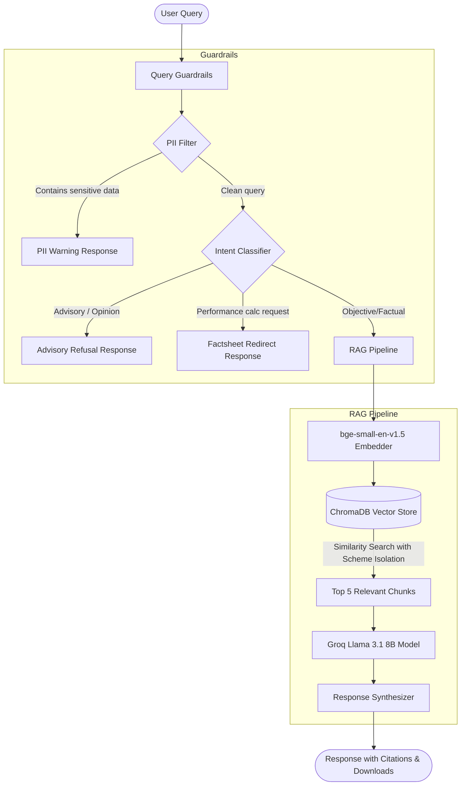

# Grow RAG: Mutual Fund Q&A Chatbot

Grow RAG is an enterprise-grade, compliance-first Retrieval-Augmented Generation (RAG) assistant designed for factual, audit-ready mutual fund Q&A. Built for the modern mutual fund investor, it enforces compliance and security guardrails to provide facts-only answers with verifiable sources.

---

## 🏛️ System Architecture



---

## 🚀 Key Features

* **Strict Scheme Isolation**: Queries are dynamically mapped to a specific fund metadata filter (e.g. `HDFC Flexi Cap Fund`), preventing hallucinated data leakage between different mutual funds.
* **Contextual Metadata Prepended Chunking**: Prepend scheme and source document metadata directly to each chunk to keep the LLM grounded in context.
* **PII Redaction & Security**: Scan and block personal identifiable information (such as Aadhaar, PAN cards, phone numbers, and email addresses) to protect user privacy.
* **SEBI/AMFI Compliance Guardrails**: Automatically filter and reject advisory questions ("Should I invest?") or performance calculations ("What is my returns?") with polite, facts-only alternative redirects.
* **Streamlit Chat Interface**: Modern Groww-style dark UI theme (`#090E17` background, `#0F172A` chat inputs/containers, and `#00C896` brand green button accents).
* **Downloadable Source Cards**: Dynamic download buttons allowing users to view and download the local source file matching the cited document.
* **Self-Correcting Database Guard**: On app startup, the app automatically checks, deletes, and rebuilds the vector database to the full 264 chunks if an outdated collection (< 100 chunks) is detected.

---

## 🛠️ Technology Stack

* **Frontend UI**: Streamlit (Python-native reactive dashboard)
* **Vector Store**: ChromaDB (Embedded SQLite database)
* **Embedding Model**: BAAI `bge-small-en-v1.5` (via `sentence-transformers`)
* **LLM Engine**: Groq Cloud API (`llama-3.1-8b-instant`)
* **Document Ingestion**: Python file scraper and BeautifulSoup parser

---

## 💻 Local Setup & Installation

### 1. Clone & Set Up Directory
```bash
git clone https://github.com/janvip08/Milestone-RAG-Chatbot.git
cd Milestone-RAG-Chatbot
```

### 2. Configure Environment Variables
Create a `.env` file in the root workspace directory:
```env
# Groq API Configuration
# Get your API key from: https://console.groq.com/keys
GROQ_API_KEY=gsk_...
```

### 3. Install Dependencies
```bash
pip install -r requirements.txt
```

### 4. Database Seeding & Startup
On startup, the Streamlit app will automatically detect if the database needs seeding. If you wish to seed the database manually, run:
```bash
# Phase 1 Ingestion
python -m ingestion.main

# Phase 2 Seeding
python -m vector_db.src.main
```

### 5. Run the Application
```bash
streamlit run streamlit_app.py
```

---

## 📈 QA Audit Results

The application includes an automated test audit script mapping to critical product requirements. The RAG pipeline passed **9 out of 9** test criteria successfully:

| Category | Input Query | Status | Pipeline Action |
|----------|-------------|--------|-----------------|
| **NAV** | *What is the NAV of HDFC Flexi Cap Direct Plan Growth?* | **PASS** | Returns `Rs. 1,850.30` with `hdfc_flexi_cap.html` citation. |
| **AUM** | *What is the AUM of HDFC Mid-Cap Opportunities Fund?* | **PASS** | Returns `Rs. 65,420 Crores` with `hdfc_mid_cap.html` citation. |
| **Benchmark** | *What is the benchmark of HDFC Large Cap Fund?* | **PASS** | Returns `Nifty 100 TRI` with `hdfc_large_cap.html` citation. |
| **Exit Load** | *What is the exit load of HDFC Focused 30 Fund?* | **PASS** | Returns `1.00% within 365 days` with `hdfc_focused_30.html` citation. |
| **Lock-in** | *What is the lock-in period for HDFC ELSS Tax Saver Fund?* | **PASS** | Returns `3 years mandatory` with `hdfc_elss_tax_saver.html` citation. |
| **Minimum SIP** | *What is the minimum SIP amount for HDFC Flexi Cap Fund?* | **PASS** | Returns `Rs. 100 per month` with `hdfc_flexi_cap.html` citation. |
| **Advisory** | *Should I invest in HDFC Mid-Cap Opportunities Fund?* | **PASS** | Blocked by compliance; redirects to AMFI Corner link. |
| **Performance** | *Calculate 5-year returns for HDFC Flexi Cap Fund.* | **PASS** | Blocked by compliance; redirects to official factsheet URL. |
| **PII Block** | *Tell me the NAV of HDFC Flexi Cap, my PAN is ABCDE1234F.* | **PASS** | Blocked by PII; returns PAN card data warning. |
